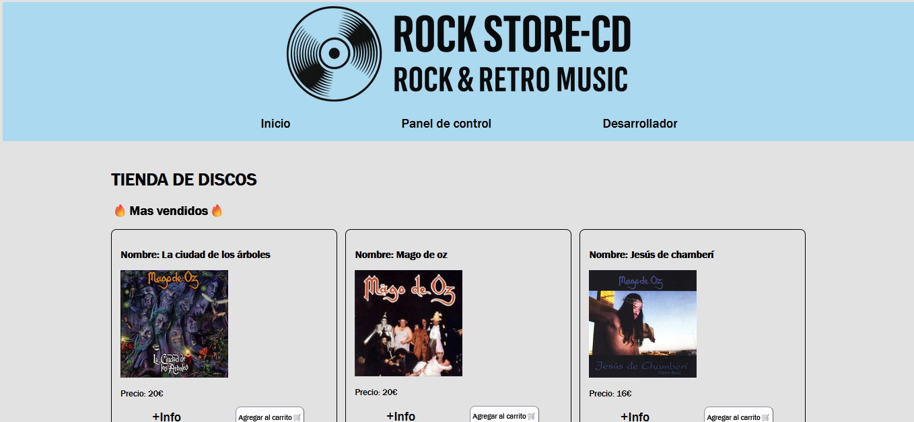
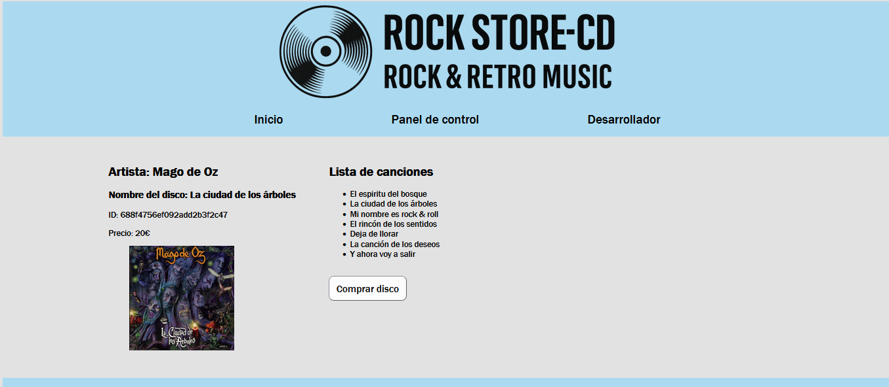
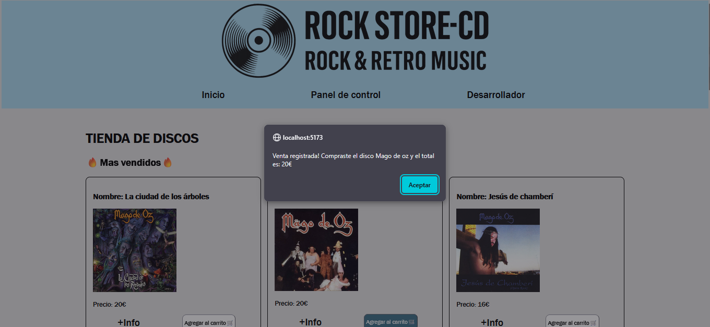
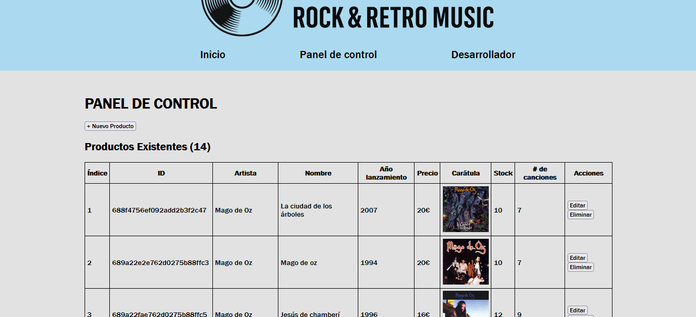
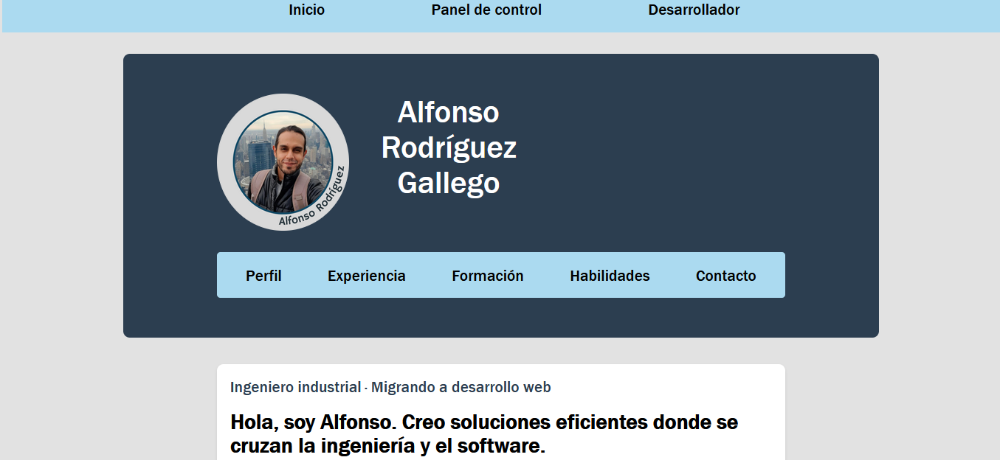
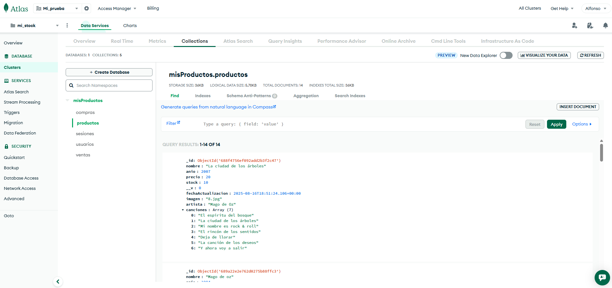
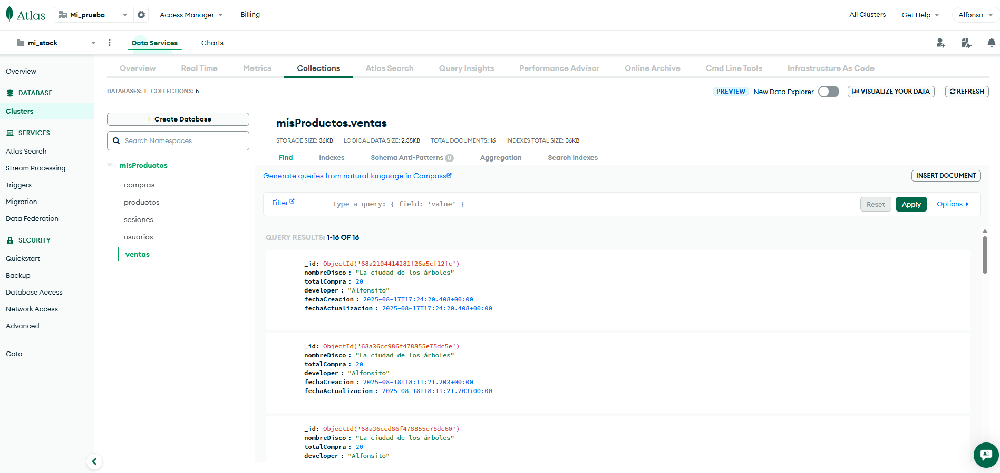

# 🛒 Tienda Web de Música

Este proyecto consiste en el desarrollo de una aplicación web de venta de discos de música, implementada como práctica personal de estudio.

**Tecnologías utilizadas**

- **Frontend:** React + Vite → para crear una interfaz rápida, modular y fácil de escalar.

- **Backend:** Node.js con Nodemon para un entorno de desarrollo dinámico.

- **Base de datos:** MongoDB → utilizada para almacenar información de los discos y de las ventas.

**Funcionalidades principales**

- **Visualización de catálogo:** la aplicación se conecta a la base de datos para mostrar los discos disponibles en la tienda.

- **Detalles de cada disco:** cada ítem cuenta con la opción **+Info** para ampliar la información.

- **Gestión de discos:** se incluye una sección administrativa donde se pueden crear, editar y eliminar discos.

- **Registro de ventas:** cada vez que un usuario compra un disco, la aplicación genera un registro en la base de datos con la información de la transacción.

**Arquitectura**

- **Cliente (Frontend):** desarrollado con React y Vite para optimizar la experiencia de usuario.

- **Servidor (Backend):** construido con Node.js y Express, ejecutándose en entorno de desarrollo con Nodemon.

- **Base de datos:** MongoDB, gestionando tanto los discos como el historial de ventas.

Este proyecto funciona como una **tienda online completa** que integra frontend, backend y base de datos, aplicando los conceptos de desarrollo fullstack.

---

### 🧾 Página principal

### 🔎 Página de detalle

### 🛍️ Registro de la compra

### 🎛️ Panel de control (CRUD)

### 👨‍💻 Información del desarrollador del proyecto

### 🗄️ BBDD de los discos en MongoDB

### 🗃️ Registro de compra creado y almacenado en la BBDD

---

## ⚙️ Tecnologías utilizadas

- ⚡ **Vite** — compilador ultrarrápido
- 🧱 **HTML, CSS y JavaScript** — base para la construcción de la interfaz de usuario y los estilos.  
- 🖥️ **Node.js + Express** — desarrollo del servidor backend.  
- 🔄 **Nodemon** — herramienta para reiniciar automáticamente el servidor en desarrollo.  
- 🗄️ **MongoDB** — base de datos NoSQL para almacenar discos y registros de ventas.  

---

## 📁 Estructura del proyecto

TIENDA-DISCOS

\`\`\`
├── node_modules/
├── public/
│ ├── assets/
│
├── src/
│ ├── components/ # Componentes reutilizables
│ ├── pages/ # Páginas principales
│ ├── services/ # Lógica de conexión con API / backend
│
├── .env # Variables de entorno
├── .env-example # Ejemplo de variables de entorno
├── .gitignore
├── eslint.config.js # Configuración de ESLint
├── index.html
├── package-lock.json
├── package.json
├── readme.md
├── vite.config.js # Configuración de Vite               
\`\`\`

---

## 🚀 ¿Cómo usar esta aplicación?

1. Clona el repositorio de backend y frontend:
   \`\`\`bash
   git clone https://github.com/AlfonsoRG0720/Proyecto-5-front-React-y-backend-Tienda-Discos.git
   \`\`\`

2. Ajusta las variables del .env.

3. Ejecuta cada proyecto en una terminal integrada individual.

4. Instala dependencias en los 2 proyectos:
   \`\`\`bash
   npm install
   \`\`\`

5. Ejecuta los dos proyectos en desarrollo:
   \`\`\`bash
   npm run dev
   \`\`\`

Extra: Puedes obtener todos los registros de ventas desde el endpoint:
   await axios.get(API_URL2)

---

## 👨‍💻 Autor

**Alfonso Rodríguez**  
📧 alfonsor814@gmail.com  
🔗 [GitHub @AlfonsoRG0720](https://github.com/AlfonsoRG0720)